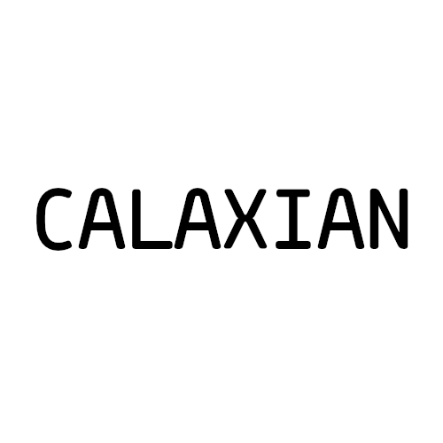

# Calaxian


Calaxian is a Galaxian remake written in C++. This is just because I like retro
games and I wanted to learn some new stuff and make sure I know OOP well enough
to hate it lol.

## Installation
**NOTICE: NOT FINISHED**
```bash
git clone https://github.com/v49480nd-km/calaxian.git
cd calaxian
make
make run
```

## Contributions
No
